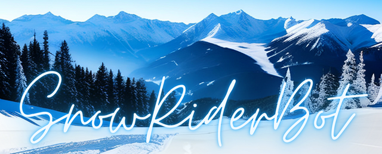

# SnowRider telegram bot
___

___
### About:
#### SnowRider is your assistant for planning mountain skiing vacations!

As an avid enthusiast of mountain vacations myself, I have focused on ensuring that the bot provides maximum assistance both during the preparation phase and during the actual vacation. The goal is to facilitate access to information and resources related to winter vacations in the Carpathian Mountains!

***For this release, the following resorts are available:***
* Slavske
* Dragobrat
* Bukovel
* Pylypets
* Play
* Yablunytsia
* Krasia
* Myhove
* Yaremche
___
### Usage:
To access the bot, please follow the link below: [@SnowRider_ua_bot](https://t.me/SnowRider_ua_bot).

All bot functions work in interactive mode, utilizing various functional keyboards and buttons for interaction.

***Functionalities available in this release:***:
* **Resort Information:** opens access to the following options:
  * *General Information:* provides information about the resort, its history, features, and advantages.
  * *About Trails:* offers details about the ski lifts, the number of trails, their length, and difficulty level.
  * *How to Get There:* provides information on how to reach the resort by train or private transportation.
  * *Places to Eat:* lists recommended dining establishments at the selected resort, along with contact details.
  * *Sightseeing:* highlights popular attractions, landmarks, and excursions at the resort.
* **Webcams:** shows links to webcams at the resort.
* **Weather:** shows the current weather conditions at the selected resort and includes a button to access a 5-day weather forecast.
* **Apartments:** shows the average cost of accommodation at the selected resort and offers additional options:
  * *View Offers:* presents up to 20 recommended lodging options at the selected resort, including prices and a link to the hotel's page on hotels24.ua.
  * *Hotels24.ua Website:* opens the hotels24.ua page with recommended accommodation options for more detailed information.
* **Trains:** provides information about the nearest train station to the resort and offers additional options:
  * *Train Schedule:* opens the train schedule for the nearest train station to the resort.
  * *Ukrzaliznytsia Bot:* refers to the Ukrzaliznytsia Telegram bot for ticket search and booking.
* **Ski Pass:** displays information on the cost of ski passes at the selected resort (for the 2022-2023 season, approximate prices are provided).

___
### Support:
I should note that this is my PET project, and it doesn't have any commercial goals at the moment. It is currently in the development stage, but I'm doing everything possible to continuously improve its functionality.

If you have any suggestions to improve the bot's functionality or if you would like to add resorts that are currently not included, feel free to contact me at snowrider.bot@gmail.com. The bot's functionality is based on my personal experience, and a fresh perspective will only make this project better!
___
### Authors and acknowledgment:
***Developer and owner of the project: Ivan Zavolzhenskyi.***

Feedback on this project is snowrider.bot@gmail.com.

To implement its functionality, the bot uses various information obtained from reliable sources such as openweathermap.org, hotels24.ua, snih.info, vkazivnyk.com, go-to.rest, and others. I am very grateful to these resources for providing the necessary information.

---
### License:
For Non-Commercial Use.

Attribution to this repository is mandatory if you use materials from this project.
___
___
### Про проєкт:
#### SnowRider це твій помічник з планування гірськолижного відпочинку!

Оскільки я сам є великим прихильником гірського відпочинку, то зосередився на тому, щоб бот максимально допомагав, як під час підготовки до відпочинку, так і під час самого відпочинку. Мета - полегшити доступ до інформації чи ресурсів, що повʼязані з зимовим відпочинком в Карпатах!

***Для цього релізу доступні такі курорти:***
* Славське
* Драгобрат
* Буковель
* Пилипець
* Плай
* Яблуниця
* Красія
* Мигове
* Яремче
___
### Користування:
Для доступу до боту перейдіть за посиланням: [@SnowRider_ua_bot](https://t.me/SnowRider_ua_bot).

Всі функції бота працюють в інтерактивному режимі, для взаємодії з ботом використовуються різноманітні функціональні клавіатури та функціональні кнопки.

***Функції, які доступні в даному релізі***:
* **Про курорт** - відкриває доступ до наступних опцій:
  * *Загальна інформація* - інформація про курорт, його історію, особливості та переваги.
  * *Про траси* - інформація про підйомники, кількість, протяжність та складність гірськолижних трас.
  * *Як доїхати* - інформація, як дістатися до курорту залізничним або власним транспортом.
  * *Де поїсти* - список гарних закладів харчування на обраному курорті з контактними даними.
  * *Що подивитись* - популярні на курорті розваги, видатні памʼятки та екскурсії.
* **Веб-камери** - відображає посилання на вебкамери курорту.
* **Погода** - відображає поточну погоду на обраному курорті, а також додає кнопку виклику прогнозу погоди на найближчі 5 днів.
* **Житло** - відображає середню вартість житла на обраному курорті та відображає додаткові опції:
    * *Переглянути пропозиції* - відображає до 20 рекомендованих варіантів осель на обраному курорті з вартістю та посиланням на сторінку оселі на hotels24.ua.
    * *На сайт Hotels24.ua* - відкриває сторінку hotels24.ua з рекомендованими варіантами розміщення для більш детального ознайомлення.
* **Потяги** - відображає інформацію про найближчу до курорту залізничну станцію, а також відображає додаткові опції:
  * *Розклад руху потягів* - відкриває розклад руху потягів по найближчій до курорту залізничній станції.
  * *Ботик Укрзалізниці* - посилається на телеграм бот укрзалізниці для пошуку і замовлення квитків.
* **Ski-pass** - відображає інформацію по вартості підйомників на обраному курорті (в даному релізі вказані орієнтовані ціни на сезон 2022-2023).

___
### Підтримка:
Одразу зазначу, це мій PET проєкт і поки що не має комерційних цілей. Він знаходиться на стадії розробки, але я роблю все можливе, щоб постійно покращувати його функціонал.

А якщо ти маєш пропозиції по покращенню роботи бота або хочеш додати курорти, яких тут поки немає, не соромся писати мені на snowrider.bot@gmail.com. Бо функціонал бота зроблений з мого особистого досвіду і свіжий погляд зробить цей проєкт тільки кращим!

___
### Автори та ресурси:
***Розробник та власник проекту Ivan Zavolzhenskyi.***

Зворотній звʼязок по цьому проєкту - snowrider.bot@gmail.com.

Для реалізації функціонала бот використовує різноманітну інформацію, що береться з таких надійних джерел, як openweathermap.org, hotels24.ua, snih.info, vkazivnyk.com, go-to.rest та інші. Дуже вдячний цим ресурсам за надану інформацію.
___
### Ліцензія:
Non-Commercial Use — Для некомерційного використання.

За використання матеріалів даного проєкту посилання на цей репозитирій є обовʼязковим.